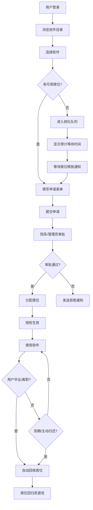

## 1. 产品概述

科研软件校园授权池是面向高校的软件授权管理系统，解决科研软件（统计、仿真、绘图等）批量采购后的席位分配、使用追踪和自动回收问题。通过规范化的申请审批流程和智能化的排队机制，提升软件资源利用效率，保障教学科研需求。

- 核心价值：实现软件授权全生命周期管理，从采购到回收全程可追溯
- 目标用户：学校IT管理员、院系教师、在校学生
- 解决痛点：席位分配混乱、资源利用率低、离职人员占用席位、热门软件等待无预期

## 2. 核心功能

### 2.1 用户角色

| 角色 | 注册方式 | 核心权限 |
|------|----------|----------|
| 学生 | 校园统一身份认证 | 浏览软件目录、申请席位、查看排队状态、查看我的授权 |
| 教师 | 校园统一身份认证 | 学生全部权限 + 关联科研项目审批、批量申请课程所需席位 |
| 管理员 | 系统初始化创建 | 软件采购管理、席位审批、用户管理、数据统计、系统配置 |

### 2.2 功能模块

1. **软件管理中心**：软件目录展示、采购信息维护、席位池管理、使用统计
2. **申请审批系统**：席位申请表单、审批流程、关联课程/项目、审批历史
3. **排队等待系统**：实时队列展示、预计等待时间计算、排队通知
4. **授权管理**：席位分配、授权有效期、自动回收机制、使用日志
5. **用户中心**：个人信息、我的申请、我的授权、消息通知
6. **统计报表**：使用率分析、院系使用排行、软件成本分析、席位周转统计

### 2.3 页面详情

| 页面名称 | 模块名称 | 功能描述 |
|----------|----------|----------|
| 登录页 | 身份认证 | 校园统一登录入口、角色选择、密码找回 |
| 首页仪表盘 | 数据概览 | 可用席位概览、热门软件排行、我的待办、最新通知 |
| 软件列表页 | 软件目录 | 软件分类筛选、搜索、详情查看、席位状态、申请入口 |
| 软件详情页 | 软件信息 | 软件介绍、席位数量、当前占用、排队情况、申请按钮 |
| 申请页 | 席位申请 | 选择软件、填写用途、关联课程/项目、院系、使用时间 |
| 审批中心页 | 审批管理 | 待办审批列表、批量审批、查看详情、审批操作 |
| 排队详情页 | 排队状态 | 队列位置、前方人数、预计等待时间、取消排队 |
| 我的授权页 | 授权管理 | 授权列表、使用状态、到期提醒、归还席位 |
| 软件管理页 | 管理员功能 | 添加软件、编辑信息、席位配置、采购记录 |
| 用户管理页 | 管理员功能 | 用户列表、角色分配、状态管理、批量导入 |
| 统计报表页 | 数据分析 | 多维度统计图表、导出报表、使用率分析 |

## 3. 核心流程

### 3.1 席位申请审批流程

用户浏览软件目录，选择目标软件查看席位可用性。若有可用席位，填写申请表单（用途、院系、课程/项目关联、使用周期）提交申请。教师/管理员根据课程安排和科研项目需求进行审批。审批通过后席位自动分配并发送通知。

### 3.2 排队等待时间计算逻辑

系统根据历史数据智能计算预计等待时间：
1. 统计该软件平均使用时长
2. 计算前方排队用户数 × 平均使用时长
3. 结合当前占用席位的剩余时间进行动态调整
4. 每5分钟更新一次预计时间

## 4. 用户界面设计

### 4.1 设计风格

**学术严谨 + 现代科技感**
- 主色调：深蓝 `#1e40af`（学术权威感）+ 翠绿 `#059669`（通过/可用状态）
- 辅助色：琥珀橙 `#d97706`（警告/等待）+ 赤红 `#dc2626`（错误/拒绝）
- 背景色：浅灰渐变 `#f8fafc → #f1f5f9`
- 字体：标题使用 **Noto Serif SC**（学术感），正文使用 **Inter**（清晰易读）
- 按钮风格：圆角8px，实心按钮带微妙阴影，hover有轻微上浮效果
- 布局风格：卡片式布局，清晰的信息层级，充足留白
- 图标：线性风格图标，简洁专业

### 4.2 页面设计概述

| 页面名称 | 模块名称 | UI元素 |
|----------|----------|--------|
| 首页仪表盘 | 数据概览 | 顶部导航栏、数据统计卡片网格、热门软件排行榜、待办事项列表、最近活动时间线 |
| 软件列表页 | 软件目录 | 搜索栏、分类筛选标签、软件卡片网格（带席位状态指示器）、分页控件 |
| 软件详情页 | 软件信息 | 软件图标与名称、介绍区块、席位状态仪表板、排队进度条、预计等待时间倒计时 |
| 申请页 | 席位申请 | 分步表单（选择软件→填写信息→确认提交）、进度指示器、实时表单验证 |
| 审批中心页 | 审批管理 | 标签页切换（待办/已办/全部）、申请卡片、批量操作工具栏、审批详情抽屉 |
| 排队详情页 | 排队状态 | 队列位置圆形指示器、前方人数列表、预计等待时间大号显示、动态更新动画 |
| 统计报表页 | 数据分析 | 多标签图表区域、时间范围选择器、数据导出按钮、交互式柱状图/折线图/饼图 |

### 4.3 响应式设计

- **桌面优先**：1440px基准设计，采用12列网格布局
- **平板适配**：992px断点，侧边栏收起为图标模式，卡片网格改为2列
- **手机适配**：576px断点，底部导航栏替代顶部，卡片改为单列布局
- **触摸优化**：按钮最小尺寸48px×48px，列表项垂直间距增加

### 4.4 交互动效

- 页面加载：卡片式组件采用staggered入场动画，依次淡入上浮
- 状态变化：席位可用/占用状态切换采用平滑过渡动画
- 排队更新：预计等待时间变化采用数字滚动动效
- 表单交互：输入框focus时边框颜色渐变，验证错误时轻微抖动反馈
-  hover效果：卡片hover时轻微上浮（translateY(-4px)），阴影加深
