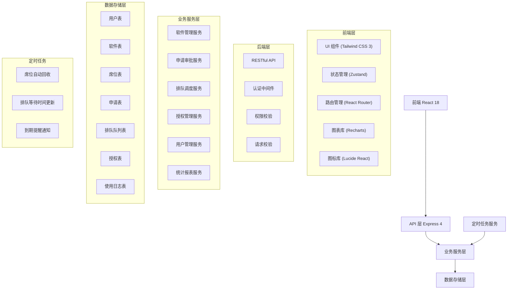
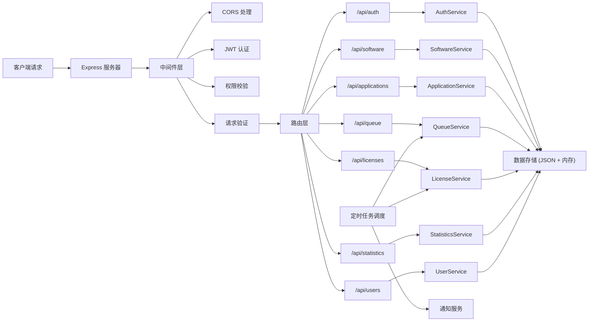
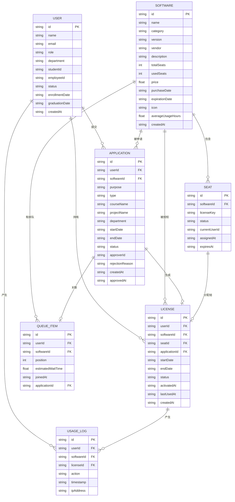

## 1. 架构设计



## 2. 技术描述

- **前端**：React 18 + TypeScript + Vite
- **样式**：Tailwind CSS 3.4.14
- **状态管理**：Zustand 4.5.0
- **路由**：React Router DOM 6.21.0
- **图表**：Recharts 2.10.0
- **图标**：Lucide React 0.300.0
- **后端**：Express 4.18.2 + TypeScript
- **HTTP 客户端**：Axios 1.6.2
- **数据库**：SQLite（本地开发，使用内存存储 + JSON 持久化）
- **认证**：JWT Token

## 3. 路由定义

| 路由 | 页面 | 权限 |
|------|------|------|
| `/login` | 登录页 | 公开 |
| `/` | 首页仪表盘 | 登录用户 |
| `/software` | 软件列表页 | 登录用户 |
| `/software/:id` | 软件详情页 | 登录用户 |
| `/apply/:softwareId` | 席位申请页 | 登录用户 |
| `/approval` | 审批中心页 | 教师/管理员 |
| `/queue/:softwareId` | 排队详情页 | 登录用户 |
| `/licenses` | 我的授权页 | 登录用户 |
| `/admin/software` | 软件管理页 | 管理员 |
| `/admin/users` | 用户管理页 | 管理员 |
| `/admin/statistics` | 统计报表页 | 管理员 |

## 4. API 定义

### 4.1 类型定义

```typescript
interface User {
  id: string;
  name: string;
  email: string;
  role: 'student' | 'teacher' | 'admin';
  department: string;
  studentId?: string;
  employeeId?: string;
  status: 'active' | 'graduated' | 'resigned';
  enrollmentDate?: string;
  graduationDate?: string;
  createdAt: string;
}

interface Software {
  id: string;
  name: string;
  category: 'statistics' | 'simulation' | 'graphics' | 'other';
  version: string;
  vendor: string;
  description: string;
  totalSeats: number;
  usedSeats: number;
  price: number;
  purchaseDate: string;
  expirationDate: string;
  icon: string;
  averageUsageHours: number;
  createdAt: string;
}

interface Seat {
  id: string;
  softwareId: string;
  licenseKey: string;
  status: 'available' | 'occupied' | 'maintenance';
  currentUserId?: string;
  assignedAt?: string;
  expiresAt?: string;
}

interface Application {
  id: string;
  userId: string;
  softwareId: string;
  purpose: string;
  type: 'course' | 'research' | 'personal';
  courseName?: string;
  projectName?: string;
  department: string;
  startDate: string;
  endDate: string;
  status: 'pending' | 'approved' | 'rejected';
  approverId?: string;
  rejectionReason?: string;
  createdAt: string;
  approvedAt?: string;
}

interface QueueItem {
  id: string;
  userId: string;
  softwareId: string;
  position: number;
  estimatedWaitTime: number;
  joinedAt: string;
  applicationId: string;
}

interface License {
  id: string;
  userId: string;
  softwareId: string;
  seatId: string;
  applicationId: string;
  startDate: string;
  endDate: string;
  status: 'active' | 'expired' | 'revoked';
  activatedAt?: string;
  lastUsedAt?: string;
  createdAt: string;
}

interface UsageLog {
  id: string;
  userId: string;
  softwareId: string;
  licenseId: string;
  action: 'activate' | 'deactivate' | 'checkout' | 'checkin';
  timestamp: string;
  ipAddress?: string;
}
```

### 4.2 接口定义

#### 认证接口
```typescript
POST /api/auth/login
Request: { email: string; password: string }
Response: { token: string; user: User }

POST /api/auth/logout
Response: { success: boolean }
```

#### 软件接口
```typescript
GET /api/software
Query: { category?: string; page?: number; pageSize?: number }
Response: { data: Software[]; total: number }

GET /api/software/:id
Response: Software

POST /api/software (管理员)
Request: Omit<Software, 'id' | 'usedSeats' | 'createdAt' | 'averageUsageHours'>
Response: Software

PUT /api/software/:id (管理员)
Request: Partial<Software>
Response: Software

DELETE /api/software/:id (管理员)
Response: { success: boolean }
```

#### 申请接口
```typescript
GET /api/applications
Query: { status?: string; userId?: string; softwareId?: string }
Response: { data: Application[]; total: number }

GET /api/applications/:id
Response: Application & { user: User; software: Software }

POST /api/applications
Request: Omit<Application, 'id' | 'status' | 'createdAt'>
Response: Application

PUT /api/applications/:id/approve (教师/管理员)
Request: { approverId: string }
Response: Application

PUT /api/applications/:id/reject (教师/管理员)
Request: { approverId: string; rejectionReason: string }
Response: Application
```

#### 排队接口
```typescript
GET /api/queue/:softwareId
Response: { items: QueueItem[]; currentUserPosition?: QueueItem }

POST /api/queue
Request: { softwareId: string; userId: string; applicationId: string }
Response: QueueItem

DELETE /api/queue/:id
Response: { success: boolean }
```

#### 授权接口
```typescript
GET /api/licenses
Query: { userId?: string; softwareId?: string; status?: string }
Response: { data: License[]; total: number }

POST /api/licenses
Request: { userId: string; softwareId: string; applicationId: string; startDate: string; endDate: string }
Response: License

PUT /api/licenses/:id/revoke
Response: License

PUT /api/licenses/:id/renew
Request: { endDate: string }
Response: License
```

#### 统计接口
```typescript
GET /api/statistics/overview
Response: {
  totalSoftware: number;
  totalSeats: number;
  usedSeats: number;
  activeUsers: number;
  pendingApplications: number;
  queueLength: number;
}

GET /api/statistics/software-usage
Query: { startDate: string; endDate: string }
Response: { softwareId: string; softwareName: string; usageHours: number; usageRate: number }[]

GET /api/statistics/department-usage
Response: { department: string; userCount: number; licenseCount: number }[]
```

## 5. 服务器架构图



## 6. 数据模型

### 6.1 数据模型定义



### 6.2 初始化数据

系统启动时将加载以下Mock数据：

**用户数据**：
- 3个管理员账号
- 10个教师账号（分布在5个院系）
- 50个学生账号（分布在5个院系，包含部分已毕业状态）

**软件数据**：
- 统计软件：SPSS、SAS、RStudio、Stata
- 仿真软件：MATLAB、Ansys、COMSOL、LabVIEW
- 绘图软件：OriginPro、Adobe Illustrator、ChemDraw、GraphPad Prism

**席位数据**：每个软件配置5-20个席位不等

**申请数据**：30条历史申请记录（含审批通过、拒绝、待审批状态）

**授权数据**：40条活跃和历史授权记录

**排队数据**：热门软件的实时排队队列
